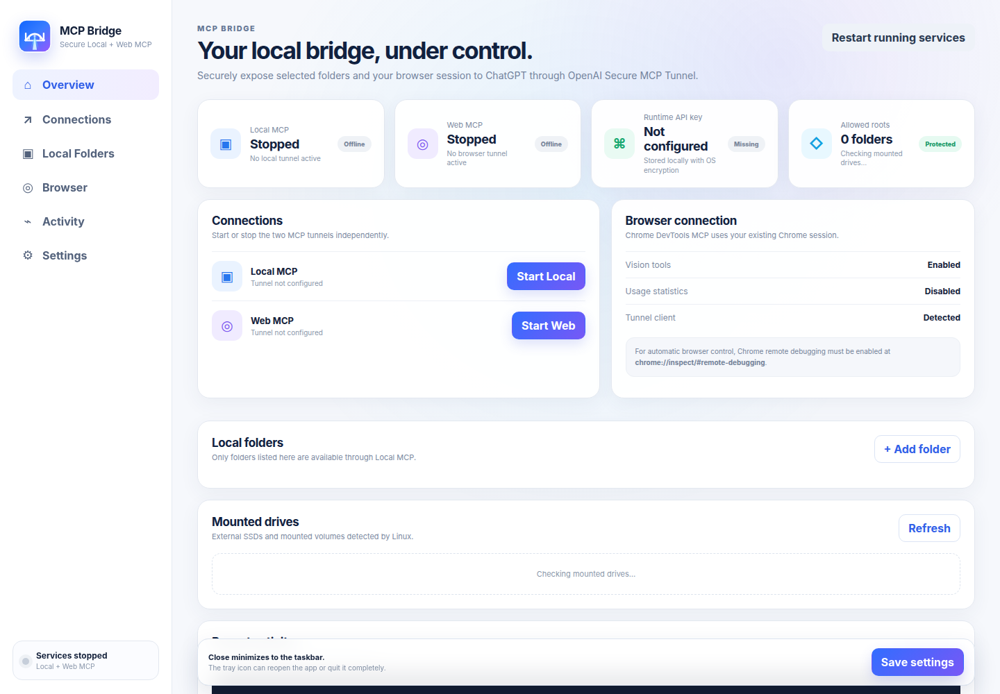

# MCP Bridge


**Securely connect ChatGPT to your local files, terminal, and existing Chrome session through OpenAI Secure MCP Tunnel.**

[Website](https://haseebgb92.github.io/ChatGPT-MCp/) · [Latest Release](https://github.com/haseebgb92/ChatGPT-MCp/releases/latest) · [Glama](https://glama.ai/mcp/servers/haseebgb92/ChatGPT-MCp) · [Security](SECURITY.md) · [Issues](https://github.com/haseebgb92/ChatGPT-MCp/issues)



## What is MCP Bridge?

MCP Bridge is a desktop app for **Linux and Windows** that keeps powerful local tools on your own computer while making them available to ChatGPT through **OpenAI Secure MCP Tunnel**.

It exposes two independent connections:

| Connection | What it does |
|---|---|
| **Local MCP** | Browse/search approved folders, read files, optionally create/edit files, and optionally run terminal commands. |
| **Web MCP** | Control your existing Chrome session through Chrome DevTools MCP: tabs, navigation, clicks, typing, screenshots, console/network inspection, and optional vision tools. |

Your files, browser session, and terminal remain on your machine. MCP Bridge only exposes the roots and capabilities you explicitly allow.

## Highlights in v0.2.1

- Fresh product-level desktop UI
- Dedicated **Bridge / Gateway** app identity and production icon
- Proper Linux taskbar/window identity — no longer grouped under ChatGPT
- System tray controls for Local MCP and Web MCP
- Closing the window minimizes instead of terminating active tunnels
- Automatic Linux mounted-drive discovery
- Friendly labels for external SSDs and mounted volumes
- Read/write validation before a mounted root is exposed
- Existing encrypted Runtime API key survives upgrades
- Built-in **cross-platform update system**
- SHA-256 verification before an update can be installed
- Linux `.deb`, Linux AppImage, and Windows NSIS `.exe` releases
- Local MCP and Web MCP remain completely independent

## Architecture

```text
                         OpenAI Secure MCP Tunnel
                                  |
                  +---------------+---------------+
                  |                               |
              Local MCP                        Web MCP
                  |                               |
          approved local roots              Chrome DevTools MCP
         /        |        \                       |
      files    folders    shell               existing Chrome
                  \                               /
                   +--------- MCP Bridge --------+
                             Linux / Windows
```

No public local MCP port needs to be exposed directly to the internet.

## Quick start

### 1. Install MCP Bridge

#### Linux

Current packaged releases target Debian / Ubuntu / Linux Mint on amd64/x86_64.

```bash
curl -fsSL -H "Accept: application/vnd.github.raw+json" \
  "https://api.github.com/repos/haseebgb92/ChatGPT-MCp/contents/install-linux.sh?ref=main" | bash
```

If Chrome/Chromium is already installed:

```bash
curl -fsSL -H "Accept: application/vnd.github.raw+json" \
  "https://api.github.com/repos/haseebgb92/ChatGPT-MCp/contents/install-linux.sh?ref=main" | SKIP_CHROME=1 bash
```

Or download the latest `.deb` from [GitHub Releases](https://github.com/haseebgb92/ChatGPT-MCp/releases/latest):

```bash
sudo apt install ./MCP-Bridge-*-linux-amd64.deb
```

#### Windows

Open PowerShell:

```powershell
Set-ExecutionPolicy -Scope Process Bypass -Force
irm "https://raw.githubusercontent.com/haseebgb92/ChatGPT-MCp/main/install-windows.ps1" | iex
```

Or download the latest Windows `.exe` from [GitHub Releases](https://github.com/haseebgb92/ChatGPT-MCp/releases/latest).

### 2. Create two OpenAI tunnels

Open:

```text
https://platform.openai.com/settings/organization/tunnels
```

Create separate tunnel IDs for Local MCP and Web MCP.

```text
Local Files
Chrome
```

Use different tunnel IDs when both services will run at the same time.

### 3. Create a Runtime API key

Open:

```text
https://platform.openai.com/settings/organization/api-keys
```

For least privilege, use a restricted key whose principal has:

```text
Tunnels: Read
Tunnels: Use
```

Do **not** use an OpenAI Admin API key as the long-running Runtime API key.

When **Remember API key securely** is enabled, MCP Bridge stores it through Electron `safeStorage` / operating-system credential encryption instead of normal settings.

### 4. Configure MCP Bridge

1. Enter the Runtime API key.
2. Enter the Local tunnel ID.
3. Enter the Web tunnel ID.
4. Add one or more approved folders.
5. Choose read-only or read/write access per root.
6. Enable file writing only if needed.
7. Enable terminal access only if needed.
8. Enable Browser vision tools if needed.
9. Optionally start MCP Bridge at OS login.
10. Start Local MCP, Web MCP, or both.

### 5. Add the connections in ChatGPT

In ChatGPT, enable Developer mode and add MCP connections using **Tunnel** as the connection method.

Local connection:

```text
Name: Local Files
Connection: Tunnel
Tunnel: <your Local tunnel ID>
```

Browser connection:

```text
Name: Chrome
Connection: Tunnel
Tunnel: <your Web tunnel ID>
```

Start the matching service in MCP Bridge before refreshing/scanning its tools in ChatGPT.

## Mounted drives on Linux

MCP Bridge automatically discovers mounted filesystems under common Linux mount locations such as:

```text
/mnt
/media/<user>
/run/media/<user>
```

Instead of making you work with an opaque mount path such as:

```text
/mnt/289E678E9E6752FC
```

the UI can show the volume label, filesystem, size, and actual mount path.

Before a mounted root is exposed, MCP Bridge resolves the real path and confirms that the current user can read it. Read/write roots are also checked for write access.

This makes external SSDs and secondary drives first-class without weakening the Local MCP path-security model.

## Desktop experience

- Dedicated app and tray icon
- Separate Linux `WM_CLASS` / desktop identity
- Click **X** to minimize instead of killing active tunnels
- Tray menu to reopen the app
- Start/stop Local MCP from the tray
- Start/stop Web MCP from the tray
- Restart running services
- Explicit **Quit** when you want the bridge terminated
- Optional launch at login
- Optional automatic Local/Web startup
- Runtime activity logs

## Built-in updates

Starting with **v0.2.1**, MCP Bridge can update itself from GitHub Releases.

### Update flow

1. Check the latest GitHub Release.
2. Compare semantic versions.
3. Select the correct installer for the current OS and architecture.
4. Download the installer locally.
5. Download the matching `.sha256` file.
6. Verify the installer before installation is enabled.
7. You explicitly choose **Install & restart**.

Automatic checks happen shortly after launch and then periodically. They can be disabled in Settings.

### Linux

```text
download → SHA-256 verify → pkexec → apt install → relaunch MCP Bridge
```

The system elevation dialog is used. MCP Bridge does not store your sudo password.

### Windows

```text
download NSIS .exe → SHA-256 verify → launch installer → MCP Bridge exits
```

Updates are **not silently installed**.

## Local MCP

### Files and folders

- Multiple approved roots
- Read-only/read/write mode per root
- Mounted Linux drive support
- List files and directories
- File metadata
- Read UTF-8 text files
- Recursive filename/content search
- Create folders
- Create or replace text files
- Real-path and traversal protection
- Symlink escape protection

### Shell

Terminal execution is optional.

Restricted shell supports normal development work while blocking several obvious destructive/system-level commands.

Examples:

```bash
npm install
npm run build
git status
git diff
git pull
git push
python script.py
adb devices
```

Restricted shell is a guardrail, **not** a complete OS sandbox.

Full shell executes Bash on Linux or PowerShell on Windows with the current user's privileges.

> **Treat Full Shell as local-user-equivalent code execution. Enable it only for a machine and MCP connection you trust.**

## Web MCP / Chrome

Web MCP uses `chrome-devtools-mcp` with your **existing Chrome session**, so ChatGPT can work with tabs and authenticated sessions already open on your computer.

Capabilities include:

- list/select/open/close tabs
- navigation
- click, hover, typing, forms, and keyboard input
- screenshots and accessibility snapshots
- console and network inspection
- performance tooling
- optional coordinate/vision tools
- optional usage-statistics opt-out

### Chrome setup

Open:

```text
chrome://inspect/#remote-debugging
```

Enable remote debugging for the Chrome profile you want MCP Bridge to use.

When Browser vision tools are enabled, MCP Bridge launches Chrome DevTools MCP with:

```text
--experimentalVision
```

## Packaged releases include

- MCP Bridge desktop app
- Local MCP server
- Chrome DevTools MCP
- Electron/Node runtime
- Full OpenAI `tunnel-client`
- Production app/tray icons

You do **not** need to manually install Node.js, npm, Go, the MCP SDK, Chrome DevTools MCP, or `tunnel-client` when using an official packaged release.

## Release artifacts

| Platform | Artifact |
|---|---|
| Linux | `MCP-Bridge-<version>-linux-amd64.deb` |
| Linux | `MCP-Bridge-<version>-linux-x86_64.AppImage` |
| Windows | `MCP-Bridge-<version>-win-x64.exe` |

Every installer also has a matching:

```text
<installer>.sha256
```

The built-in updater refuses to install an update if its checksum is missing or does not match.

## Build from source

### Linux

```bash
git clone https://github.com/haseebgb92/ChatGPT-MCp.git
cd ChatGPT-MCp
npm install
npm start
```

### Windows

```powershell
git clone https://github.com/haseebgb92/ChatGPT-MCp.git
cd ChatGPT-MCp
npm install
npm start
```

A development run expects a full `tunnel-client` either on PATH or selected in Advanced settings.

## Build installers

```bash
npm install
npm run check
```

Linux:

```bash
npm run dist:linux
```

Windows:

```powershell
npm run dist:win
```

GitHub Actions builds the official release artifacts and SHA-256 sidecars from version tags.

## Security

MCP Bridge deliberately exposes powerful local capabilities, so use the smallest access level that fits the task.

- Never commit Runtime API keys.
- Prefer a restricted Runtime API key.
- Use separate tunnel IDs for Local and Web MCP.
- Prefer read-only roots unless write access is required.
- Mounted roots are real-path checked before use.
- Enable shell only when required.
- Full shell is not a sandbox.
- Chrome MCP can act inside logged-in browser sessions.
- Review consequential actions before allowing them.
- Runtime logs redact OpenAI-style `sk-` keys.
- Update installers are SHA-256 verified before installation.

See [SECURITY.md](SECURITY.md) for details.

## Project structure

```text
.
├── .github/workflows/build.yml
├── assets/
├── bundled/
│   └── local-mcp/
├── docs/
│   └── images/
├── install-linux.sh
├── install-windows.ps1
├── src/
│   ├── main.js
│   ├── preload.js
│   ├── updater.js
│   └── renderer/
├── LICENSE
├── package.json
└── README.md
```

## Current release

**v0.2.1**

This release adds the verified cross-platform updater on top of the v0.2.0 redesign, standalone desktop identity, tray workflow, and Linux mounted-drive support.

[Download the latest release](https://github.com/haseebgb92/ChatGPT-MCp/releases/latest)

## License

MIT License.

## Credits

- OpenAI Secure MCP Tunnel / `tunnel-client`
- Model Context Protocol
- Chrome DevTools MCP
- Electron

Built by **Advertpreneur**.
