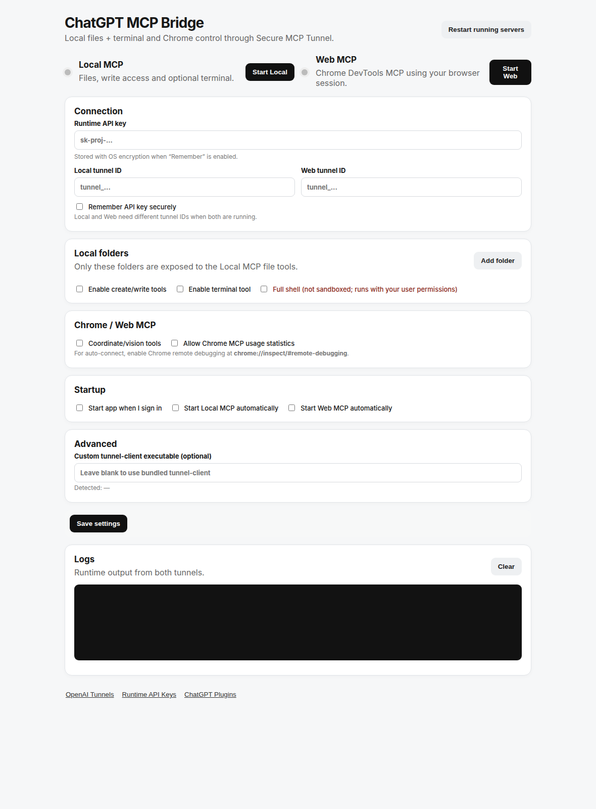

# ChatGPT MCP Bridge

**Use ChatGPT with the files, terminal, and logged-in Chrome session already on your own computer — through OpenAI Secure MCP Tunnel, without exposing a public MCP endpoint.**

[Website](https://haseebgb92.github.io/ChatGPT-MCp/) · [Latest Release](https://github.com/haseebgb92/ChatGPT-MCp/releases/latest) · [Glama](https://glama.ai/mcp/servers/haseebgb92/ChatGPT-MCp) · [Security](SECURITY.md) · [Issues](https://github.com/haseebgb92/ChatGPT-MCp/issues)



ChatGPT MCP Bridge is a cross-platform desktop/tray app for **Linux and Windows**. It gives ChatGPT two independent local capabilities:

| Connection | What it does |
|---|---|
| **Local MCP** | Browse/search approved folders, read files, optionally create/edit files, and optionally run terminal commands. |
| **Web MCP** | Control your existing Chrome session with `chrome-devtools-mcp`: tabs, navigation, clicks, typing, screenshots, DevTools inspection, and optional coordinate/vision tools. |

Your browser session, local files, and shell stay on your machine. ChatGPT reaches the bridge through **OpenAI Secure MCP Tunnel**.

> **Important:** ChatGPT MCP Bridge does not create OpenAI tunnels or API keys for you. You create them in your own OpenAI Platform account and enter them into the app.

## Why this exists

Most MCP servers are hosted somewhere else. That is not useful when the thing you want ChatGPT to work with is already on your own PC — your project folders, terminal, development tools, and authenticated Chrome tabs.

ChatGPT MCP Bridge turns that local environment into controlled MCP capabilities while keeping the runtime local.

Typical uses include:

- ask ChatGPT to inspect or update a local project without repeatedly uploading files;
- let ChatGPT run approved development commands such as `git status`, builds, tests, or ADB commands;
- work with websites already open and logged in inside your normal Chrome profile;
- inspect browser console/network output while debugging;
- keep **Local MCP** and **Web MCP** independently enabled or disabled;
- expose only the folders and capabilities you actually want to use.

## Architecture

```text
                         OpenAI Secure MCP Tunnel
                                  |
             +--------------------+--------------------+
             |                                         |
      Local Files app                            Chrome app
             |                                         |
             v                                         v
      ChatGPT MCP Bridge ---------------------- ChatGPT MCP Bridge
             |                                         |
        Local MCP                               Chrome DevTools MCP
       /    |    \                                      |
   files  folders  optional shell                existing Chrome
```

There is no need to expose a local MCP port directly to the public internet.

## Quick start

### 1. Install the bridge

#### Linux

Current packages target **Debian / Ubuntu / Linux Mint on amd64/x86_64**.

```bash
curl -fsSL -H "Accept: application/vnd.github.raw+json" "https://api.github.com/repos/haseebgb92/ChatGPT-MCp/contents/install-linux.sh?ref=main" | bash
```

If you already have Chrome/Chromium and do not want the installer to install Google Chrome:

```bash
curl -fsSL -H "Accept: application/vnd.github.raw+json" "https://api.github.com/repos/haseebgb92/ChatGPT-MCp/contents/install-linux.sh?ref=main" | SKIP_CHROME=1 bash
```

Or download the latest `.deb` manually from [GitHub Releases](https://github.com/haseebgb92/ChatGPT-MCp/releases/latest):

```bash
sudo apt install ./ChatGPT-MCP-Bridge*.deb
```

#### Windows

Open PowerShell:

```powershell
Set-ExecutionPolicy -Scope Process Bypass -Force; irm "https://raw.githubusercontent.com/haseebgb92/ChatGPT-MCp/main/install-windows.ps1" | iex
```

Or download the latest Windows `.exe` installer from [GitHub Releases](https://github.com/haseebgb92/ChatGPT-MCp/releases/latest).

### 2. Create two OpenAI tunnels

Open:

https://platform.openai.com/settings/organization/tunnels

Create two separate tunnel IDs:

```text
Local Files
Chrome
```

Use a different tunnel ID for Local MCP and Web MCP if both will run at the same time.

### 3. Create a Runtime API key

Open:

https://platform.openai.com/settings/organization/api-keys

For least privilege, use a restricted key whose principal has:

```text
Tunnels: Read
Tunnels: Use
```

Do **not** use an OpenAI Admin API key as the long-running tunnel Runtime API key.

When **Remember API key securely** is enabled, the bridge stores it using Electron `safeStorage` / the operating system's credential encryption rather than putting the secret directly into normal settings.

### 4. Configure the desktop app

Enter:

1. Runtime API key
2. Local tunnel ID
3. Web tunnel ID
4. One or more allowed local folders
5. Read-only/read-write mode per folder
6. Whether Local MCP may write files
7. Whether Local MCP may run terminal commands
8. Whether Web MCP coordinate/vision tools are enabled
9. Optional auto-start at login

Then start either or both services:

```text
Local MCP   ON
Web MCP     ON
```

### 5. Add the MCP connections in ChatGPT

In ChatGPT, enable **Developer mode** under **Settings → Security and login**, then open **Plugins** and create MCP connections using **Tunnel** as the connection method. Availability can depend on account/workspace policy.

Local connection:

```text
Name: Local Files
Connection: Tunnel
Tunnel: <your Local tunnel ID>
```

Browser connection:

```text
Name: Chrome
Connection: Tunnel
Tunnel: <your Web tunnel ID>
```

Start the matching service in ChatGPT MCP Bridge before refreshing/scanning its tools in ChatGPT.

## What gets installed

Packaged releases include the runtime pieces needed by the bridge:

- Desktop tray app
- Local MCP server
- Chrome DevTools MCP
- Electron/Node runtime
- Full OpenAI `tunnel-client`

You do **not** need to manually install Node.js, npm, Go, the MCP SDK, Chrome DevTools MCP, or `tunnel-client` when using a packaged release.

On supported Linux systems, the one-command installer also installs required system packages and installs Google Chrome Stable automatically if Chrome/Chromium is not already available.

## Local MCP

### Files and folders

- Multiple allowed local roots
- Read-only/read-write mode per folder
- List files and folders
- Inspect file metadata
- Read UTF-8 text files
- Recursive filename/content search
- Create folders
- Create or replace text files
- Filesystem path traversal/symlink checks

### Shell

Terminal execution is optional.

#### Restricted shell

Designed for common development work while blocking several obvious destructive/system-level commands.

Examples:

```bash
npm install
npm run build
git status
git diff
git pull
git push
python script.py
adb devices
```

Restricted shell is a guardrail, **not** a complete OS sandbox.

#### Full shell

Full shell executes Bash on Linux or PowerShell on Windows with the current user's privileges.

> **Treat Full Shell as local-user-equivalent code execution. Enable it only for a machine and MCP connection you trust.**

## Web MCP / Chrome

Web MCP uses `chrome-devtools-mcp` and your **existing Chrome session**, so ChatGPT can work with tabs and authenticated sessions already open on your computer.

Capabilities include:

- navigate/open/close/select tabs;
- click, hover, type, fill forms, and send keyboard input;
- screenshots and accessibility snapshots;
- console and network inspection;
- performance/Lighthouse tooling;
- optional coordinate/vision tools;
- optional usage-statistics opt-out.

### Chrome setup

Open:

```text
chrome://inspect/#remote-debugging
```

Enable remote debugging for your local Chrome profile.

When **Coordinate/vision tools** is enabled, ChatGPT MCP Bridge launches Chrome DevTools MCP with:

```text
--experimentalVision
```

## Desktop app

- Linux and Windows
- System tray/taskbar controls
- Start/stop Local MCP independently
- Start/stop Web MCP independently
- Restart running services
- Optional launch at OS login
- Optional MCP auto-start
- Runtime logs
- Secure Runtime API-key storage
- Bundled full OpenAI `tunnel-client` in packaged releases

## Windows installer details

The PowerShell installer can:

1. install Git if missing;
2. install Node.js LTS if missing;
3. install Go if missing;
4. download ChatGPT MCP Bridge;
5. install npm dependencies;
6. build the full OpenAI `tunnel-client.exe`;
7. validate the application;
8. build the Windows installer;
9. launch the generated installer.

If `raw.githubusercontent.com` is stale or blocked on your network:

```powershell
Set-ExecutionPolicy -Scope Process Bypass -Force
$script = Invoke-RestMethod -Headers @{ Accept = "application/vnd.github.raw+json" } -Uri "https://api.github.com/repos/haseebgb92/ChatGPT-MCp/contents/install-windows.ps1?ref=main"
Invoke-Expression $script
```

## Build from source

Source builds are mainly for contributors. Packaged releases are easier for normal use.

### Linux

```bash
git clone https://github.com/haseebgb92/ChatGPT-MCp.git
cd ChatGPT-MCp
npm install
npm start
```

### Windows

```powershell
git clone https://github.com/haseebgb92/ChatGPT-MCp.git
cd ChatGPT-MCp
npm install
npm start
```

A source/development run expects a full `tunnel-client` either on PATH or selected in the app's Advanced settings.

## Building installers

GitHub Actions is configured in:

```text
.github/workflows/build.yml
```

Version tags build and publish:

| Platform | Artifacts |
|---|---|
| Linux | `.deb`, `.AppImage` |
| Windows | NSIS `.exe` |

The workflow also compiles and bundles the full OpenAI `tunnel-client`.

Example release:

```bash
git tag v0.1.0
git push origin v0.1.0
```

## Local development

```bash
npm install
npm run check
```

Linux:

```bash
npm run dist:linux
```

Windows:

```powershell
npm run dist:win
```

Build output is written to `dist/`.

## Security

This project deliberately exposes powerful local capabilities, so use the smallest access level that fits the task.

- Never commit Runtime API keys.
- Prefer a restricted Runtime API key.
- Use separate tunnel IDs for Local and Web MCP.
- Prefer read-only roots unless write access is required.
- Enable shell only when needed.
- Full shell is not a sandbox.
- Chrome MCP can act inside logged-in browser sessions.
- Review consequential actions before allowing them.
- The app redacts OpenAI-style `sk-` keys from runtime logs.

See [SECURITY.md](SECURITY.md) for details.

## Project structure

```text
.
├── .github/workflows/build.yml
├── assets/
├── bundled/
│   └── local-mcp/
├── install-linux.sh
├── src/
│   ├── main.js
│   ├── preload.js
│   └── renderer/
├── .gitignore
├── LICENSE
├── package.json
└── README.md
```

## Current status

**v0.1.3**

The current release focuses on making Local MCP and Chrome MCP simple to run from a tray app on Linux and Windows.

## License

MIT License.

## Credits

- OpenAI Secure MCP Tunnel / `tunnel-client`
- Model Context Protocol
- Chrome DevTools MCP
- Electron

Built by **Advertpreneur**.
